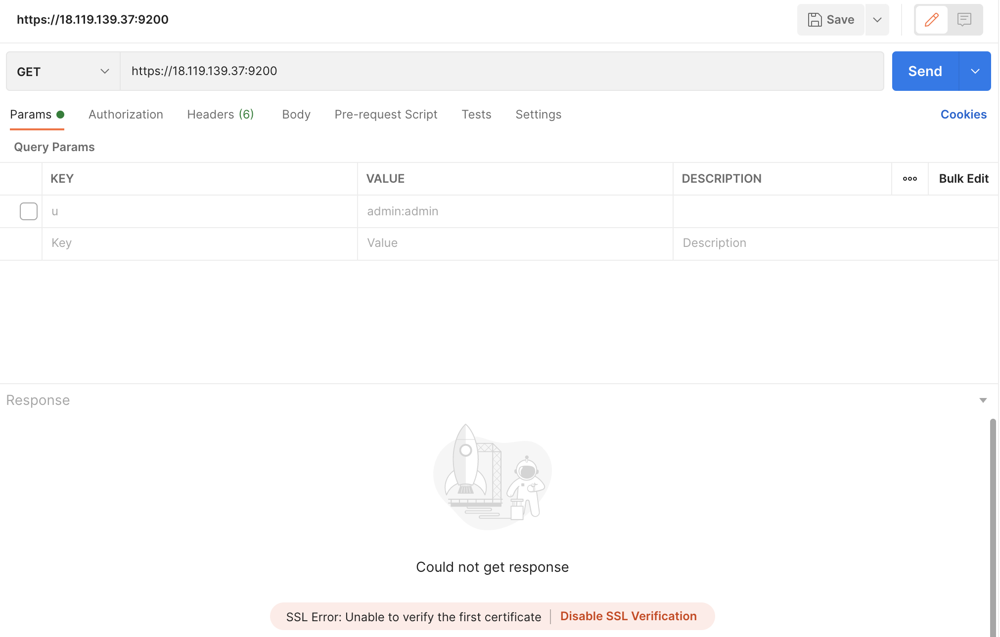
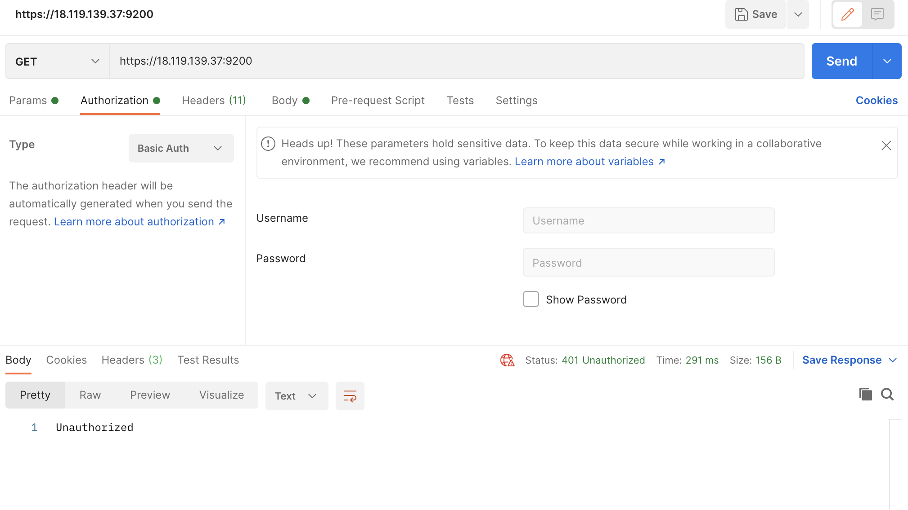
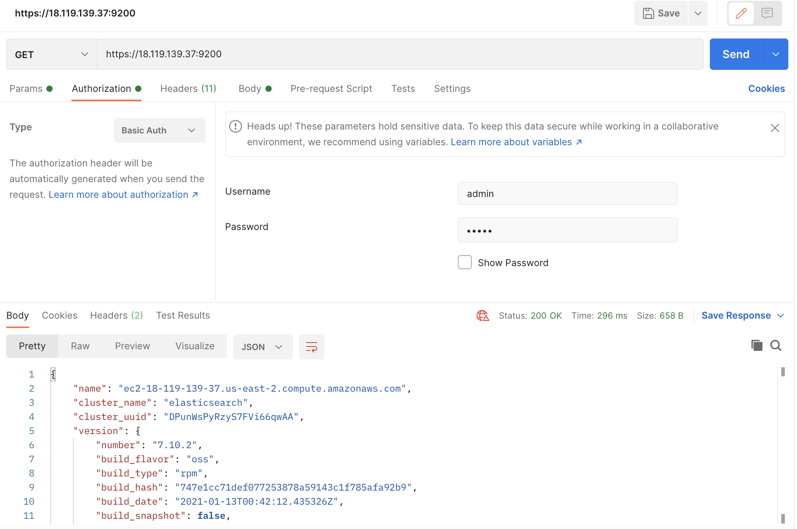
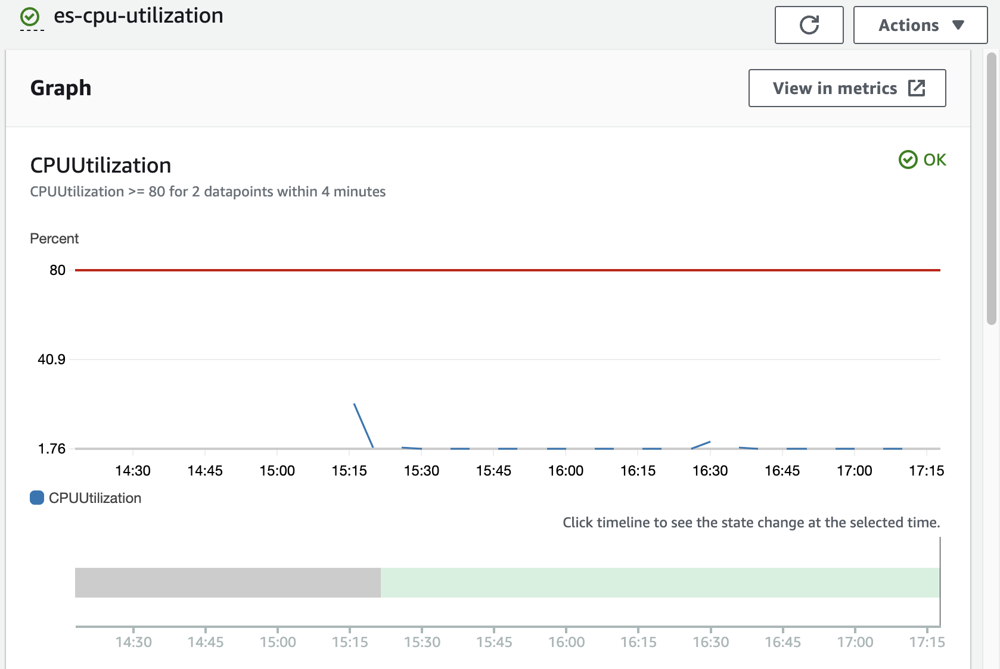
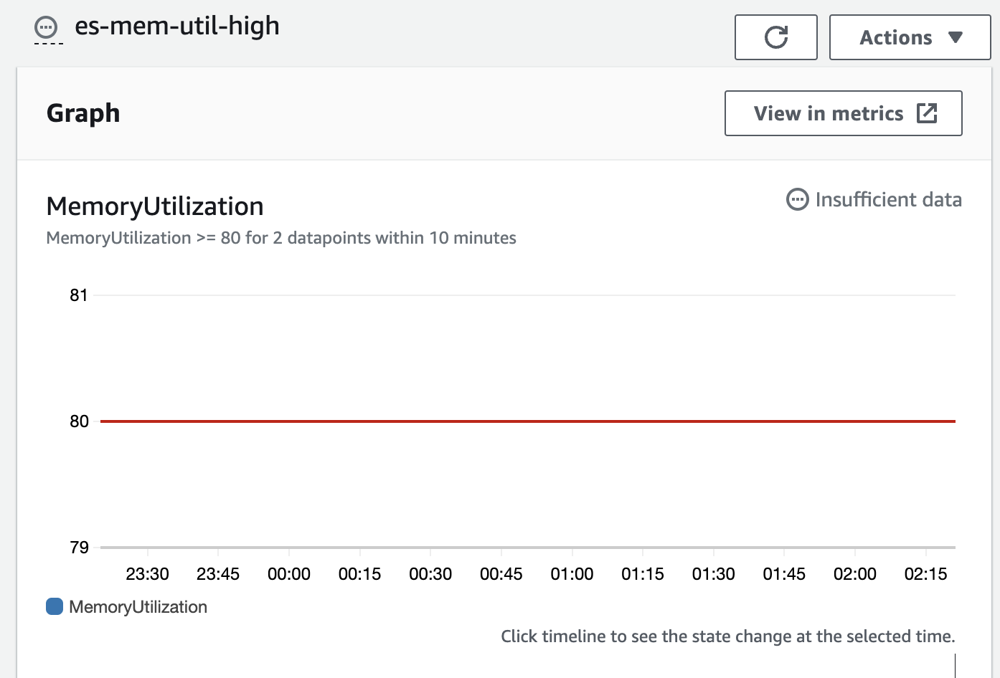

# Overview of the solution
Terraform templates are under: https://github.com/chuckskull1/ES/tree/main/Terraform
Terraform template for:
- Elasticsearch(main.tf)
  - Brings up EC2 instance
  - Makes iam-role for the instance
  - Installs jdk-1.8.0
  - Installs elasticsearch using opendistro
  - Downloads config file for elasticsearch from s3
- Cloudwatch (cloudwatch.tf)
   - Makes CPUUtilization matrices
   - Makes MemoryUtilization matrices

- This solution launches an EC2 instance and installs jdk and open distro in it. Then before starting the elasticsearch service it downloads configuration file (which can be found in the root folder itself naming config.yml) from s3 bucket changes the value of node name and network-host in the run time and then start the service. I have used opendistro since it is rich in features for security and is open source.

- Resources used during the solutions were mainly [open distro documentation](https://opendistro.github.io/for-elasticsearch-docs/docs/install/rpm/) and [terraform documentation](https://registry.terraform.io/providers/hashicorp/aws/latest/docs).

- Time spent for the solution being 1 day wwhere I had to look onto my project dependency as well.

---
#### What did you choose to automate the provisioning and bootstrapping of the instance? Why?
I used terraform to automate and provision and bootstraping of the instance as it is easy to use, rich in documentation, good hands-on experience.

#### How did you choose to secure ElasticSearch? Why?
Open Distro for Elasticsearch has its own security plugin for authentication and access control. The plugin provides numerous features to help you secure your cluster. I have used it's HTTP basic authentication feature to have secure communication using TLS. For TLS dummy SSL is used as of now but can be replaced with CA authorised certificate in actual case.

This shows our ES setup needs to have SSL for communication

Requires credentials to access the Elasticsearch node else it shows unauthorised.

Once username and password are configured it allows the access (SSL has been disabled for this call).

Here we can specify the CA authorised certificates instead of dummy SSL provided by Open Distro.
Open Distro also provides features like RBAC control, support for Active directory, index-level, document-level and field-level security which can be used to make the node more secure.

#### How would you monitor this instance? What metrics would you monitor?
The instance can be monitored using cloudwatch and alarms can be setup accordingly. As of now the solution has cloudwatch matrices for CPUUtilisation and Memory usage. It can be extended to other things like disk usage(EBS volume), jvm pressure.

This shows the CPU utilisation for ES node

This shows the CPU utilisation for ES node

Open distro also provides performance analyzer which can also be used to monitor cluster performance.

#### Could you extend your solution to launch a secure cluster of ElasticSearch nodes? What would need to change to support this use case?
Basic security like IAM role and security groups have been implemented in the solution. To increase the security for the cluster we can enable node to node encryption which will help the traffic between nodes to be encrypted.
Current solution provides the capability to launch a node which can be extended to launch multiple nodes and connect them together using the cluster section in the elasticsearch.yaml itself. Discovery plugin would be really helpful in this case.

#### Could you extend your solution to replace a running ElasticSearch instance with little or no downtime? How?
It can be extended to replace running instance with little down time but for no downtime we can use AWS provided elasticsearch service but that would add on to the cost.

#### Was it a priority to make your code well structured, extensible, and reusable?
Yes, the solution can be reused to bring up multiple nodes of elasticsearch.

#### What sacrifices did you make due to time?
I wasn't able to implement clustering, could have used modular approach for IaaC so that it can be made much more extensible.
